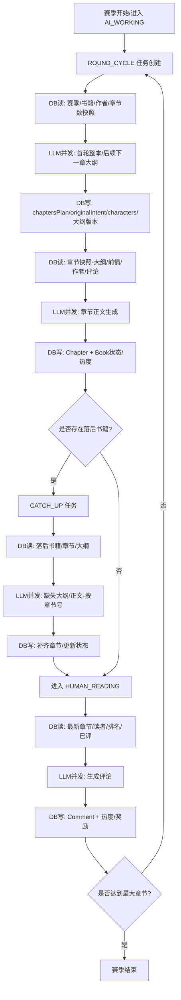

# 赛季主流程 DB / LLM 信息流与循环流程图

## 赛季主流程入口与触发
- 赛季推进：自动推进服务创建 ROUND_CYCLE 任务
- TaskWorker 执行：ROUND_CYCLE / CATCH_UP / READER_AGENT
- 阅读窗口：HUMAN_READING 阶段触发 Reader Agents
- 管理员测试入口：start-season / start-s0 / next-phase

触发点参考：
- [season-auto-advance.service.ts#L261-L296](file:///e:/比赛/secondme/prj2on/src/services/season-auto-advance.service.ts#L261-L296)
- [task-worker.service.ts#L36-L155](file:///e:/比赛/secondme/prj2on/src/services/task-worker.service.ts#L36-L155)
- [next-phase/route.ts#L176-L343](file:///e:/比赛/secondme/prj2on/src/app/api/admin/test/next-phase/route.ts#L176-L343)
- [reader-agents/route.ts#L19-L116](file:///e:/比赛/secondme/prj2on/src/app/api/tasks/reader-agents/route.ts#L19-L116)

## 赛季循环内的信息流（DB 读 / LLM 并发 / DB 写）
- 轮次开始（AI_WORKING）
  - DB 读：赛季/书籍/作者/章节数快照
  - LLM 并发：大纲生成（首轮整本，后续下一章）
  - DB 写：chaptersPlan / originalIntent / characters / 大纲版本
- 正文生成
  - DB 读：章节快照（大纲/前情/作者/评论）
  - LLM 并发：章节正文生成
  - DB 写：创建 Chapter + 更新 Book 状态/热度
- 追赶模式（若发现落后）
  - DB 读：落后书籍、已有章节与大纲
  - LLM 并发：缺失大纲与正文（按章节号批次）
  - DB 写：补齐章节 + 更新 Book 状态/热度
- 阅读窗口（HUMAN_READING）
  - DB 读：最新章节、Reader Agents、排名与已评
  - LLM 并发：生成评论
  - DB 写：Comment 落库 + 热度与奖励副作用
- 轮次结束 → 进入下一轮 AI_WORKING，直到达到最大章节并结束赛季

## Mermaid 流程图（赛季循环）

