# 赛季流程 DB 读写与 SQL 明细（细化到表与语句）

## 范围
- 赛季自动推进 + 任务队列 + ROUND_CYCLE（大纲/章节/AI 评论/落后检测）
- Reader Agent 评论与评分、打赏相关的 DB 读写
- 人类阅读阶段的核心互动（收藏/点赞/阅读/打赏）

## 关键表与用途
- season：赛季状态、轮次、阶段、时间窗口
- taskQueue：异步任务队列
- book：书籍元信息、大纲、状态、评分/热度
- chapter：章节正文、状态、计数
- comment：AI/人类评论
- bookOutlineVersion：大纲版本历史
- user：用户余额、配置
- reading：阅读/收藏状态
- like：点赞

## Mermaid：并发/顺序读写流程图

```mermaid
flowchart TB
  subgraph Phase_A[赛季推进与任务入队]
    A1[season.findFirst 读 season]
    A2[season.update 写 season]
    A3[taskQueue.create 写 taskQueue]
  end

  subgraph Phase_B[任务处理与锁]
    B1[pg_try_advisory_lock 读锁]
    B2[taskQueue.findFirst 读 taskQueue]
    B3[taskQueue.update 写 taskQueue]
    B4[pg_advisory_unlock 释放锁]
  end

  subgraph Phase_C[ROUND_CYCLE: 大纲]
    C1[book.findMany 读 book]
    C2[book.findUnique 读 book/author]
    C3[season.findUnique 读 season]
    C4[comment.findMany 读 comment]
    C5[book.update 写 book]
    C6[bookOutlineVersion.create 写 bookOutlineVersion]
  end

  subgraph Phase_D[ROUND_CYCLE: 章节]
    D1[book.findMany 读 book]
    D2[chapter.findMany 读 chapter]
    D3[comment.findMany 读 comment]
    D4[chapter.create 写 chapter]
    D5[book.update 写 book]
  end

  subgraph Phase_E[ROUND_CYCLE: AI 评论]
    E1[chapter.findUnique 读 chapter/book]
    E2[user.findMany 读 user]
    E3[comment.findFirst 读 comment]
    E4[comment.create 写 comment]
    E5[chapter.update 写 chapter]
    E6[book.findUnique 读 book]
    E7[book.update 写 book]
    E8[user.update 写 user]
  end

  subgraph Phase_F[落后检测/追赶]
    F1[taskQueue.create 写 taskQueue]
    F2[book.findMany 读 book]
    F3[book.findUnique 读 book]
    F4[chapter.findMany 读 chapter]
    F5[chapter.create 写 chapter]
    F6[book.update 写 book]
  end

  Phase_A --> Phase_B --> Phase_C --> Phase_D --> Phase_E --> Phase_F
```


## SQL/表清单（按流程与步骤）

### 1) 赛季推进与任务入队（顺序）
来源：[season-auto-advance.service.ts](file:///e:/比赛/secondme/prj2on/src/services/season-auto-advance.service.ts#L131-L365)  
- 读 season
  - Prisma：`season.findFirst({ where: { status: 'ACTIVE' }, orderBy: { startTime: 'desc' } })`
  - 等价 SQL：
    ```sql
    SELECT * FROM "season"
    WHERE "status" = 'ACTIVE'
    ORDER BY "startTime" DESC
    LIMIT 1;
    ```
- 写 season（推进阶段/轮次）
  - Prisma：`season.update({ where: { id }, data: { currentRound, roundPhase, roundStartTime } })`
  - 等价 SQL：
    ```sql
    UPDATE "season"
    SET "currentRound" = ?, "roundPhase" = ?, "roundStartTime" = ?
    WHERE "id" = ?;
    ```
- 写 season（记录 aiWorkStartTime）
  - Prisma：`season.update({ where: { id }, data: { aiWorkStartTime } })`
  - 等价 SQL：
    ```sql
    UPDATE "season"
    SET "aiWorkStartTime" = ?
    WHERE "id" = ?;
    ```
- 写 taskQueue（创建 ROUND_CYCLE）
  - Prisma：`taskQueue.create({ data: { taskType, payload, status, priority, attempts, maxAttempts } })`
  - 等价 SQL：
    ```sql
    INSERT INTO "taskQueue"(...) VALUES (...);
    ```
- 写 season（赛季结束）
  - Prisma：`season.update({ where: { id }, data: { status: 'FINISHED', roundPhase: 'NONE', endTime } })`
  - 等价 SQL：
    ```sql
    UPDATE "season" SET "status"='FINISHED', "roundPhase"='NONE', "endTime"=? WHERE "id"=?;
    ```
- 写 book（赛季结束批量完结）
  - Prisma：`book.updateMany({ where: { seasonId, status: 'ACTIVE' }, data: { status: 'COMPLETED' } })`
  - 等价 SQL：
    ```sql
    UPDATE "book" SET "status"='COMPLETED' WHERE "seasonId"=? AND "status"='ACTIVE';
    ```
- 读 book（统计）
  - Prisma：`book.count({ where: { seasonId, status: 'COMPLETED' } })`
  - 等价 SQL：
    ```sql
    SELECT COUNT(*) FROM "book" WHERE "seasonId"=? AND "status"='COMPLETED';
    ```

### 2) 任务队列与锁（顺序）
来源：[task-worker.service.ts](file:///e:/比赛/secondme/prj2on/src/services/task-worker.service.ts#L158-L299)、[task-queue.service.ts](file:///e:/比赛/secondme/prj2on/src/services/task-queue.service.ts#L53-L195)  
- 读锁
  - Prisma：`prisma.$queryRaw` + `pg_try_advisory_lock`
  - 等价 SQL：
    ```sql
    SELECT pg_try_advisory_lock(779187) AS locked;
    ```
- 读 taskQueue（找待处理任务）
  - Prisma：`taskQueue.findFirst({ where: { OR: [PENDING, PROCESSING超时] }, orderBy: [priority desc, createdAt asc] })`
  - 等价 SQL：
    ```sql
    SELECT * FROM "taskQueue"
    WHERE ("status"='PENDING' OR ("status"='PROCESSING' AND "startedAt"< ?))
    ORDER BY "priority" DESC, "createdAt" ASC
    LIMIT 1;
    ```
- 写 taskQueue（标记处理中）
  - Prisma：`taskQueue.update({ where: { id }, data: { status: 'PROCESSING', startedAt, attempts: { increment: 1 } } })`
  - 等价 SQL：
    ```sql
    UPDATE "taskQueue"
    SET "status"='PROCESSING', "startedAt"=?, "attempts"="attempts"+1
    WHERE "id"=?;
    ```
- 写 taskQueue（完成/失败）
  - Prisma：`taskQueue.update({ status: 'COMPLETED'/'FAILED' })`
  - 等价 SQL：
    ```sql
    UPDATE "taskQueue" SET "status"=?, "completedAt"=?, "errorMessage"=? WHERE "id"=?;
    ```
- 写 taskQueue（清理）
  - Prisma：`taskQueue.deleteMany({ where: { status in [...], createdAt < ? } })`
  - 等价 SQL：
    ```sql
    DELETE FROM "taskQueue"
    WHERE "status" IN ('COMPLETED','FAILED') AND "createdAt" < ?;
    ```
- 释放锁
  - Prisma：`prisma.$queryRaw` + `pg_advisory_unlock`
  - 等价 SQL：
    ```sql
    SELECT pg_advisory_unlock(779187);
    ```

### 3) ROUND_CYCLE 步骤1：大纲生成（并发：读库准备阶段）
来源：[outline-generation.service.ts](file:///e:/比赛/secondme/prj2on/src/services/outline-generation.service.ts#L107-L673)  
- 读 book（含作者配置）
  - Prisma：`book.findUnique({ include: { author: { select: { id, nickname, agentConfig } } } })`
  - 等价 SQL：
    ```sql
    SELECT * FROM "book" WHERE "id"=?;
    SELECT "id","nickname","agentConfig" FROM "user" WHERE "id"=?;
    ```
- 读 book（检查已有大纲）
  - Prisma：`book.findUnique({ select: { chaptersPlan: true } })`
  - 等价 SQL：
    ```sql
    SELECT "chaptersPlan" FROM "book" WHERE "id"=?;
    ```
- 读 season
  - Prisma：`season.findUnique({ where: { id: book.seasonId } })`
  - 等价 SQL：
    ```sql
    SELECT * FROM "season" WHERE "id"=?;
    ```
- 写 book（保存初始大纲）
  - Prisma：`book.update({ data: { originalIntent, chaptersPlan, characters } })`
  - 等价 SQL：
    ```sql
    UPDATE "book" SET "originalIntent"=?, "chaptersPlan"=?, "characters"=? WHERE "id"=?;
    ```
- 写 bookOutlineVersion（初始版本）
  - Prisma：`bookOutlineVersion.create({ data: { bookId, version, roundCreated, originalIntent, characters, chaptersPlan, reason } })`
  - 等价 SQL：
    ```sql
    INSERT INTO "bookOutlineVersion"(...) VALUES (...);
    ```
- 读 bookOutlineVersion（版本号）
  - Prisma：`bookOutlineVersion.findFirst({ where: { bookId }, orderBy: { version: 'desc' } })`
  - 等价 SQL：
    ```sql
    SELECT * FROM "bookOutlineVersion" WHERE "bookId"=? ORDER BY "version" DESC LIMIT 1;
    ```
- 读 comment（章节反馈）
  - Prisma：`comment.findMany({ where: { bookId, chapter: { chapterNumber }, isHuman? }, orderBy, take })`
  - 等价 SQL：
    ```sql
    SELECT * FROM "comment"
    WHERE "bookId"=? AND "chapterId" IN (
      SELECT "id" FROM "chapter" WHERE "chapterNumber"=?
    )
    ORDER BY "createdAt" DESC
    LIMIT ?;
    ```
- 写 book（优化后大纲）
  - Prisma：`book.update({ data: { chaptersPlan } })`
  - 等价 SQL：
    ```sql
    UPDATE "book" SET "chaptersPlan"=? WHERE "id"=?;
    ```

### 4) ROUND_CYCLE 步骤2：章节生成（三段式并发）
来源：[chapter-writing.service.ts](file:///e:/比赛/secondme/prj2on/src/services/chapter-writing.service.ts#L92-L397)  
**准备阶段（并发读库）**  
- 读 book（含作者/章节）
  - Prisma：`book.findUnique({ include: { author, chapters } })`
  - 等价 SQL：
    ```sql
    SELECT * FROM "book" WHERE "id"=?;
    SELECT "id","nickname","agentConfig" FROM "user" WHERE "id"=?;
    SELECT * FROM "chapter" WHERE "bookId"=? ORDER BY "chapterNumber" DESC LIMIT 1;
    ```
- 读 book（大纲）
  - Prisma：`book.findUnique({ select: { chaptersPlan, characters } })`
  - 等价 SQL：
    ```sql
    SELECT "chaptersPlan","characters" FROM "book" WHERE "id"=?;
    ```
- 读 season（约束）
  - Prisma：`season.findUnique({ where: { id: book.seasonId } })`
  - 等价 SQL：
    ```sql
    SELECT * FROM "season" WHERE "id"=?;
    ```
- 读 chapter（前两章内容）
  - Prisma：`chapter.findMany({ where: { bookId, chapterNumber: { lt } }, orderBy, take })`
  - 等价 SQL：
    ```sql
    SELECT "content","title","chapterNumber"
    FROM "chapter"
    WHERE "bookId"=? AND "chapterNumber" < ?
    ORDER BY "chapterNumber" DESC
    LIMIT 2;
    ```
- 读 comment（上一章反馈）
  - Prisma：`comment.findMany({ where: { bookId, chapter: { chapterNumber } }, orderBy, take })`
  - 等价 SQL：同上 comment 查询

**写库阶段（并发写库）**  
- 写 chapter（发布新章）
  - Prisma：`chapter.create({ data: { bookId, chapterNumber, title, content, status, publishedAt, contentLength } })`
  - 等价 SQL：
    ```sql
    INSERT INTO "chapter"(...) VALUES (...);
    ```
- 写 book（更新当前章节与状态）
  - Prisma：`book.update({ data: { currentChapter, status } })`
  - 等价 SQL：
    ```sql
    UPDATE "book" SET "currentChapter"=?, "status"=? WHERE "id"=?;
    ```
- 写 book（热度与评分增量）
  - Prisma：`book.update({ data: { heatValue, finalScore, viewCount } })`
  - 等价 SQL：
    ```sql
    UPDATE "book"
    SET "heatValue"="heatValue"+?,
        "finalScore"="finalScore"+?,
        "viewCount"="viewCount"+?
    WHERE "id"=?;
    ```

### 5) ROUND_CYCLE 步骤3：AI 评论（Reader Agent 并发）
来源：[reader-agent.service.ts](file:///e:/比赛/secondme/prj2on/src/services/reader-agent.service.ts#L92-L505)  
**读库准备阶段（并发）**  
- 读 chapter + book + author
  - Prisma：`chapter.findUnique({ include: { book: { include: { author } } } })`
  - 等价 SQL：
    ```sql
    SELECT * FROM "chapter" WHERE "id"=?;
    SELECT * FROM "book" WHERE "id"=?;
    SELECT "id","nickname" FROM "user" WHERE "id"=?;
    ```
- 读 user（筛选启用 Reader）
  - Prisma：`user.findMany({ select: { id, nickname, readerConfig } })`
  - 等价 SQL：
    ```sql
    SELECT "id","nickname","readerConfig" FROM "user";
    ```
- 读 season（当前赛季）
  - Prisma：`season.findFirst({ where: { status: 'ACTIVE' }, orderBy: { createdAt: 'desc' } })`
  - 等价 SQL：
    ```sql
    SELECT * FROM "season" WHERE "status"='ACTIVE' ORDER BY "createdAt" DESC LIMIT 1;
    ```
- 读 book（热度排名）
  - Prisma：`book.findMany({ where: { seasonId }, orderBy: { heatValue: 'desc' } })`
  - 等价 SQL：
    ```sql
    SELECT * FROM "book" WHERE "seasonId"=? ORDER BY "heatValue" DESC;
    ```
- 读 comment（避免重复评论）
  - Prisma：`comment.findFirst({ where: { chapterId, userId, isHuman: false } })`
  - 等价 SQL：
    ```sql
    SELECT * FROM "comment"
    WHERE "chapterId"=? AND "userId"=? AND "isHuman"=false
    LIMIT 1;
    ```
- 读 user（判断是否 AI Agent）
  - Prisma：`user.findUnique({ select: { agentConfig } })`
  - 等价 SQL：
    ```sql
    SELECT "agentConfig" FROM "user" WHERE "id"=?;
    ```

**写库阶段（并发）**  
- 写 comment（AI 评论落库）
  - Prisma：`comment.create({ data: { bookId, chapterId, userId, isHuman:false, aiRole, rating, praise, critique } })`
  - 等价 SQL：
    ```sql
    INSERT INTO "comment"(...) VALUES (...);
    ```
- 写 chapter（评论数 +1）
  - Prisma：`chapter.update({ data: { commentCount: { increment: 1 } } })`
  - 等价 SQL：
    ```sql
    UPDATE "chapter" SET "commentCount"="commentCount"+1 WHERE "id"=?;
    ```
- 读 book（评分计算用）
  - Prisma：`book.findUnique({ include: { chapters: { where: { status:'PUBLISHED' } } } })`
  - 等价 SQL：
    ```sql
    SELECT * FROM "book" WHERE "id"=?;
    SELECT * FROM "chapter" WHERE "bookId"=? AND "status"='PUBLISHED' ORDER BY "publishedAt" DESC;
    ```
- 写 book（评分结果写回）
  - Prisma：`book.update({ data: { interactionScore, sentimentScore, finalScore, heatValue, completenessBonus, adaptabilityBonus, scoreLastCalculated } })`
  - 等价 SQL：
    ```sql
    UPDATE "book" SET ... WHERE "id"=?;
    ```
- 写 user（评论奖励）
  - Prisma：`user.update({ data: { totalInk: { increment: rewardInk } } })`
  - 等价 SQL：
    ```sql
    UPDATE "user" SET "totalInk"="totalInk"+? WHERE "id"=?;
    ```
- 打赏（事务）
  - Prisma：`prisma.$transaction([user.update, user.update, book.update])`
  - 等价 SQL：
    ```sql
    UPDATE "user" SET "totalInk"="totalInk"-? WHERE "id"=?;
    UPDATE "user" SET "totalInk"="totalInk"+? WHERE "id"=?;
    UPDATE "book" SET "coinCount"="coinCount"+?, "heatValue"="heatValue"+? WHERE "id"=?;
    ```

### 6) ROUND_CYCLE 步骤4：落后检测与追赶（混合顺序+并发）
来源：[task-worker.service.ts](file:///e:/比赛/secondme/prj2on/src/services/task-worker.service.ts#L91-L143)、[chapter-writing.service.ts](file:///e:/比赛/secondme/prj2on/src/services/chapter-writing.service.ts#L419-L619)  
- 读 book（活跃书籍 + 章节数）
  - Prisma：`book.findMany({ where: { seasonId, status:'ACTIVE' }, include: { _count:{ chapters }, chapters, author } })`
  - 等价 SQL：
    ```sql
    SELECT * FROM "book" WHERE "seasonId"=? AND "status"='ACTIVE';
    SELECT COUNT(*) FROM "chapter" WHERE "bookId"=?;
    SELECT "chapterNumber" FROM "chapter" WHERE "bookId"=?;
    SELECT "agentConfig" FROM "user" WHERE "id"=?;
    ```
- 写 taskQueue（创建 CATCH_UP）
  - Prisma：`taskQueue.create({ taskType:'CATCH_UP', payload, priority })`
  - 等价 SQL：同 taskQueue INSERT
- 读 book（检查大纲）
  - Prisma：`book.findUnique({ select: { chaptersPlan } })`
  - 等价 SQL：`SELECT "chaptersPlan" FROM "book" WHERE "id"=?;`
- 写 book（生成大纲或补全大纲）
  - Prisma：`book.update({ data: { chaptersPlan } })`
  - 等价 SQL：`UPDATE "book" SET "chaptersPlan"=? WHERE "id"=?;`
- 写 chapter / book（补写章节）
  - Prisma：`chapter.create` + `book.update`
  - 等价 SQL：同章节生成

### 7) 人类阅读阶段核心互动（并发取决于请求量）
来源：[interaction.service.ts](file:///e:/比赛/secondme/prj2on/src/services/interaction.service.ts#L7-L392)  
- 收藏/取消收藏（reading + book）
  - Prisma：`reading.findFirst` / `reading.create|delete` + `book.update`
  - 表：reading、book
- 点赞/取消点赞（like + chapter + book）
  - Prisma：`like.findUnique` / `like.create|delete` + `chapter.update` + `book.update`
  - 表：like、chapter、book
- 记录阅读（reading + chapter）
  - Prisma：`reading.upsert` + `chapter.update`
  - 表：reading、chapter
- 完成阅读（reading + chapter + book）
  - Prisma：`reading.updateMany` + `chapter.update` + `book.update`
  - 表：reading、chapter、book
- 打赏（user + book，事务）
  - Prisma：`prisma.$transaction([user.update, user.update, book.update])`
  - 表：user、book

## 并发关系摘要
- 任务队列锁：同一实例内单 Worker 串行执行任务（`pg_try_advisory_lock`）
- 大纲/章节/评论：每步内部存在并发（`runWithConcurrency` + DB_CONCURRENCY）
- AI 评论与评分、打赏在章节落库后异步触发（`setTimeout`），与主流程并发

