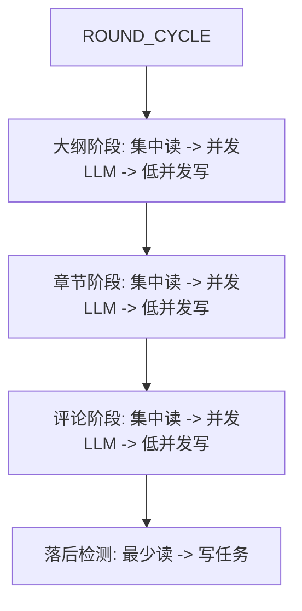

# 方法A：DB读写集中化与低并发改造 PRD（可执行）

## 背景与目标
- 背景：当前大纲/章节/评论各自并发读写 DB，导致连接池占满、慢、报错
- 目标：DB 并发稳定在 1~3，允许整体时延变长；LLM 并发不受影响
- 约束：不引入新技术、不改架构边界，只在现有服务内做“读集中/写集中”

## 不向后兼容声明
- 本次为底层重大改动，不保留旧实现与兼容分支
- 旧流程与旧函数路径统一替换为新三段式流程
- 改造完成后不保留回退开关与兼容入口

## 方案概述（方法A）
- 现有代码已具备三段式框架，本方案是**三段式内部优化**
- 每个阶段执行：**集中读库 → 并发 LLM → 低并发写库**
- 读写集中在阶段内部，不跨阶段搬迁到 Worker
- DB 并发由统一环境变量控制，单阶段读写并发<=3

## 设计原则
- 读写统一：每个阶段只做一次或少量读，一次或少量写
- LLM 并发与 DB 并发分离
- 数据结构在阶段内缓存，避免重复查询
- 写入阶段可分批执行，保证低并发
- 纠正现有三段式内部的重复查询与写库分散问题

## 改动清单（逐文件、逐点可执行）

### 1) src/services/outline-generation.service.ts
**现状问题**  
- 生成大纲时，多次查询 book/season/comment，且在循环中并发读  
- 写库分散在单本书流程中  

**改动建议**  
1. **集中读**：在 `generateOutlinesForSeason` 入口一次性读出目标 books + authorConfig + season  
2. **缓存数据**：把 book/season/author 数据写入 `PreparedOutlineGeneration`，避免后续重复查询  
3. **集中写**：新增“写库阶段队列”，批量执行 `book.update` + `bookOutlineVersion.create`  
4. **并发策略**：读库并发=1~2，写库并发=1~2；LLM 并发保留

**修改点（可执行）**  
- `generateOutlinesForSeason`：  
  - 改为一次性 `book.findMany`（含 author/season）  
  - 将 `prepareOutlineGeneration` 改为可接收已读数据  
  - 将 `persistOutline` 改为可返回写入任务（不直接写库）
- `persistOutline`：  
  - 把 `prisma.book.update` 与 `saveOutlineVersion` 改成“写入任务列表”

**意义**  
减少读库次数，降低单阶段 DB 并发峰值，提升稳定性

---

### 2) src/services/chapter-writing.service.ts
**现状问题**  
- `prepareChapterGeneration` 对 book/season/chapters/comment 多次查询  
- `persistGeneratedChapter` 直接写库，且被并发调用  
- 章节完成后 100ms 异步触发评论，存在与写库阶段叠加风险  

**改动建议**  
1. **集中读**：在 `writeChaptersForSeason` 中统一读需要的数据（book + author + season + chaptersPlan + recent chapters + comments）  
2. **缓存准备数据**：把准备结果统一放入 `preparedJobs`，不再在内部重复读  
3. **集中写**：写库阶段改为低并发批量处理  

**修改点（可执行）**  
- `writeChaptersForSeason`：  
  - 先统一读 `book.findMany` + `chapter.findMany` + `comment.findMany`  
  - 构建“准备快照”，交给 LLM 并发  
  - 将 `persistGeneratedChapter` 调整为“写入批处理函数”
- `persistGeneratedChapter`：  
  - 拆分为“写操作集合”，由写入阶段统一执行

**意义**  
把 DB 操作聚合到单一写入阶段，避免并发写库造成连接池耗尽

---

### 3) src/services/reader-agent.service.ts
**现状问题**  
- `dispatchReaderAgents` 内部读库/写库都并发  
- 读者选择、重复评论检测导致多次 DB 查询  

**改动建议**  
1. **集中读**：在阶段开始一次性获取 chapter/book/author、读者列表、排名  
2. **批量生成**：LLM 并发生成评论  
3. **集中写**：评论写入 + 章节 commentCount 更新 低并发执行  

**修改点（可执行）**  
- `dispatchReaderAgents`：  
  - 先查一次 `chapter.findUnique`（含 book/author）  
  - 先查一次 `user.findMany`  
  - 先查一次 `book.findMany` 用于排名  
  - 读者过滤逻辑改用缓存数据  
  - 写入阶段统一处理 `comment.create` + `chapter.update`

**意义**  
读写集中在少数 SQL 上，评论阶段不再扩散 DB 并发

---

### 4) src/services/task-worker.service.ts
**现状问题**  
- ROUND_CYCLE 内部串行，但每步内部并发读写  

**改动建议**  
- 在 ROUND_CYCLE 维持步骤顺序不变  
- 在每步内部通过“集中读/集中写”把 DB 并发收敛  
- 增加日志标记每步“读阶段/LLM阶段/写阶段”

**意义**  
不改变业务流程，只改变 DB 访问方式，风险可控

---

### 5) 环境变量与并发策略
**新增/调整建议**  
- `DB_CONCURRENCY=1~2`  
- `LLM_CONCURRENCY` 保持现有值或按业务容量微调  
- 读库阶段和写库阶段统一使用 DB_CONCURRENCY

**意义**  
确保 Prisma 连接池需求稳定在 1~3 级别

## 改造后流程（Mermaid）


## 验证方式
- 观察 Prisma 连接池错误是否消失  
- 观察单次 ROUND_CYCLE 完成耗时是否可接受  
- 记录每阶段 DB 并发峰值（可通过日志或 APM 观测）

## 交付物
- 代码改造（上述文件）  
- 并发策略与环境变量调整  
- 运行验证结果（错误率下降、DB 并发稳定）

---

# 详细方案与代码示例（补充）

## 现状重点读写点（代码级）

### outline-generation.service.ts
- 读：`prepareOutlineGeneration` 多次 `book.findUnique`、`season.findUnique`
- 读：`getAllChapterComments`、`getChapterFeedbacks` 多次 `comment.findMany`
- 写：`persistOutline` 内 `book.update`、`saveOutlineVersion` 内 `bookOutlineVersion.create`
- 读写分散，容易在并发中重复触发

### chapter-writing.service.ts
- 读：`prepareChapterGeneration` 每本书多次读 `book/season/chapters/comment`
- 写：`persistGeneratedChapter` 连续写 `chapter.create`、`book.update`（多次）
- 并发阶段与写库阶段重叠

### reader-agent.service.ts
- 读：`dispatchReaderAgents` 内部 `prepareReaderComment` 再读 `comment`、`user`
- 写：`persistReaderComment` 写 `comment`、`chapter.update`、评分计算、Ink 奖励与自动打赏
- 读写并发叠加明显

### task-worker.service.ts
- `ROUND_CYCLE` 串行流程合理，但每步内部读写并发
- 章节完成后异步触发 Reader Agent，存在并发叠加风险

---

## 统一三段式执行模型（细化）

### 阶段模板
1. 集中读库：一次性读取该阶段所需的最小集合
2. 并发 LLM：仅使用内存快照构建 prompt
3. 低并发写库：统一批处理写入

### 并发规则
- 任何阶段内部只允许“单层并发”
- DB 读与 DB 写都使用 `DB_CONCURRENCY`
- LLM 并发独立由 `LLM_CONCURRENCY` 控制

---

## 逐文件改造细节（含结构示例）

### 1) src/services/outline-generation.service.ts

#### 1.1 新增快照结构
```ts
type OutlineReadSnapshot = {
  bookId: string;
  bookTitle: string;
  authorId: string;
  authorNickname: string;
  agentConfig: Record<string, unknown>;
  zoneStyle: string;
  season: {
    id: string;
    themeKeyword: string | null;
    constraints: unknown;
    zoneStyles: unknown;
    maxChapters: number | null;
    minChapters: number | null;
  };
  existingChaptersPlan: Array<{ number: number; title: string; summary: string; key_events: string[]; word_count_target: number }> | null;
};
```

#### 1.2 集中读库入口
```ts
async buildOutlineSnapshots(seasonId: string): Promise<OutlineReadSnapshot[]> {
  const books = await prisma.book.findMany({
    where: { seasonId, status: 'ACTIVE' },
    include: { author: { select: { id: true, nickname: true, agentConfig: true } }, season: true },
  });
  return books.map((book) => ({
    bookId: book.id,
    bookTitle: book.title,
    authorId: book.author.id,
    authorNickname: book.author.nickname,
    agentConfig: book.author.agentConfig as Record<string, unknown>,
    zoneStyle: book.zoneStyle,
    season: {
      id: book.season?.id ?? '',
      themeKeyword: book.season?.themeKeyword ?? null,
      constraints: book.season?.constraints ?? null,
      zoneStyles: book.season?.zoneStyles ?? null,
      maxChapters: book.season?.maxChapters ?? null,
      minChapters: book.season?.minChapters ?? null,
    },
    existingChaptersPlan: (book.chaptersPlan as Array<{ number: number; title: string; summary: string; key_events: string[]; word_count_target: number }>) || null,
  }));
}
```

#### 1.3 修改 prepareOutlineGeneration 签名
```ts
async prepareOutlineGeneration(snapshot: OutlineReadSnapshot, testMode: boolean): Promise<PreparedOutlineGeneration | null> {
  if (!testMode && snapshot.existingChaptersPlan) return null;
  const authorToken = await getUserTokenById(snapshot.authorId);
  if (!authorToken) throw new Error(`无法获取作者 ${snapshot.authorNickname} 的 Token`);
  const chapterPreferenceText = Number(snapshot.agentConfig.maxChapters || 5) <= 3
    ? '短篇小说风格（精简干练，节奏快）'
    : Number(snapshot.agentConfig.maxChapters || 5) >= 7
      ? '长篇小说风格（宏大叙事，细节丰富）'
      : '中篇小说风格（平衡适当，详略得当）';
  return {
    bookId: snapshot.bookId,
    bookTitle: snapshot.bookTitle,
    authorId: snapshot.authorId,
    authorNickname: snapshot.authorNickname,
    authorToken,
    systemPrompt: buildAuthorSystemPrompt({
      userName: snapshot.authorNickname,
      writerPersonality: String(snapshot.agentConfig.writerPersonality || ''),
      writingStyle: String(snapshot.agentConfig.writingStyle || '多变'),
      adaptability: Number(snapshot.agentConfig.adaptability ?? 0.5),
      preferredGenres: (snapshot.agentConfig.preferredGenres as string[]) || [],
      seasonTheme: snapshot.season.themeKeyword ?? '',
      constraints: snapshot.season.constraints as string[],
      zoneStyle: snapshot.zoneStyle,
      wordCountTarget: Number(snapshot.agentConfig.wordCountTarget || 2000),
    }),
    outlinePrompt: buildOutlinePrompt({
      preferredGenres: (snapshot.agentConfig.preferredGenres as string[]) || [],
      wordCountTarget: Number(snapshot.agentConfig.wordCountTarget || 2000),
      seasonTheme: snapshot.season.themeKeyword ?? '',
      constraints: snapshot.season.constraints as string[],
      zoneStyle: snapshot.zoneStyle,
      minChapters: snapshot.season.minChapters ?? 1,
      maxChapters: snapshot.season.maxChapters ?? 5,
      chapterPreference: chapterPreferenceText,
    }),
    testMode,
  };
}
```

#### 1.4 写入任务结构与批处理
```ts
type OutlineWriteJob = {
  bookId: string;
  outlineData: { summary: string; characters: unknown[]; chapters: unknown[] };
  roundCreated: number;
  reason: string;
};
```

```ts
async persistOutlineBatch(jobs: OutlineWriteJob[]): Promise<void> {
  await this.runWithConcurrency(jobs, this.getDbConcurrency(), async (job) => {
    await prisma.book.update({
      where: { id: job.bookId },
      data: {
        originalIntent: job.outlineData.summary,
        chaptersPlan: toJsonValue(job.outlineData.chapters),
        characters: toJsonValue(job.outlineData.characters),
      },
    });
    await this.saveOutlineVersion(job.bookId, job.roundCreated, job.reason);
  });
}
```

#### 1.5 后续轮次 generateNextChapterOutline 的集中读
- 当前实现会为每本书重复读取 book、chaptersPlan、comments
- 建议新增批量入口：一次性取出 books + chaptersPlan + 目标章节评论，再逐书构建 prompt

示例结构：
```ts
async buildNextOutlineSnapshots(bookIds: string[], targetRound: number) {
  const books = await prisma.book.findMany({
    where: { id: { in: bookIds } },
    include: { author: { select: { id: true, nickname: true, agentConfig: true } } },
  });
  const comments = await prisma.comment.findMany({
    where: {
      bookId: { in: bookIds },
      chapter: { chapterNumber: Math.max(0, targetRound - 1) },
    },
    orderBy: { createdAt: 'desc' },
    take: 200,
  });
  return { books, comments };
}
```

---

### 2) src/services/chapter-writing.service.ts

#### 2.1 新增快照结构
```ts
type ChapterReadSnapshot = {
  bookId: string;
  bookTitle: string;
  authorId: string;
  authorNickname: string;
  agentConfig: Record<string, unknown>;
  seasonTheme: string;
  seasonConstraints: string[];
  chaptersPlan: Array<{ number: number; title: string; summary: string; key_events: string[]; word_count_target: number }>;
  recentChapters: Array<{ chapterNumber: number; title: string; content: string | null }>;
  recentComments: string[];
};
```

#### 2.2 集中读库入口
```ts
async buildChapterSnapshots(seasonId: string, chapterNumber: number): Promise<ChapterReadSnapshot[]> {
  const books = await prisma.book.findMany({
    where: { seasonId, status: 'ACTIVE' },
    include: { author: { select: { id: true, nickname: true, agentConfig: true } }, season: true },
  });
  const bookIds = books.map((b) => b.id);
  const chapters = await prisma.chapter.findMany({
    where: { bookId: { in: bookIds } },
    orderBy: { chapterNumber: 'desc' },
  });
  const comments = await prisma.comment.findMany({
    where: {
      bookId: { in: bookIds },
      chapter: { chapterNumber: Math.max(0, chapterNumber - 1) },
    },
    orderBy: { createdAt: 'desc' },
    take: 200,
  });
  return books.map((book) => ({
    bookId: book.id,
    bookTitle: book.title,
    authorId: book.author.id,
    authorNickname: book.author.nickname,
    agentConfig: book.author.agentConfig as Record<string, unknown>,
    seasonTheme: book.season?.themeKeyword ?? '',
    seasonConstraints: (book.season?.constraints as string[]) || [],
    chaptersPlan: (book.chaptersPlan as Array<{ number: number; title: string; summary: string; key_events: string[]; word_count_target: number }>) || [],
    recentChapters: chapters.filter((c) => c.bookId === book.id).slice(0, 2),
    recentComments: comments
      .filter((c) => c.bookId === book.id)
      .map((c) => c.content || '')
      .filter((c) => c.length > 10)
      .slice(0, 3),
  }));
}
```

#### 2.3 写入任务结构与批处理
```ts
type ChapterWriteJob = {
  bookId: string;
  chapterNumber: number;
  title: string;
  content: string;
  bookMaxChapters: number;
};
```

```ts
async persistChapterBatch(jobs: ChapterWriteJob[]): Promise<Array<{ chapterId: string; bookId: string }>> {
  const published: Array<{ chapterId: string; bookId: string }> = [];
  await this.runWithConcurrency(jobs, this.getDbConcurrency(), async (job) => {
    const newChapter = await prisma.chapter.create({
      data: {
        bookId: job.bookId,
        chapterNumber: job.chapterNumber,
        title: job.title,
        content: job.content,
        status: 'PUBLISHED',
        publishedAt: new Date(),
        contentLength: job.content.length,
      },
    });
    const isCompleted = job.chapterNumber >= job.bookMaxChapters;
    await prisma.book.update({
      where: { id: job.bookId },
      data: { currentChapter: job.chapterNumber, status: isCompleted ? 'COMPLETED' : 'ACTIVE' },
    });
    await prisma.book.update({
      where: { id: job.bookId },
      data: {
        heatValue: { increment: 100 },
        finalScore: { increment: 100 + Math.floor(Math.random() * 50) },
        viewCount: { increment: Math.floor(Math.random() * 50) },
      },
    });
    published.push({ chapterId: newChapter.id, bookId: job.bookId });
  });
  return published;
}
```

写库阶段结束后再触发评论，避免与写入阶段并发叠加：
```ts
const published = await this.persistChapterBatch(jobs);
await this.runWithConcurrency(published, this.getDbConcurrency(), async (item) => {
  await readerAgentService.dispatchReaderAgents(item.chapterId, item.bookId);
});
```

---

### 3) src/services/reader-agent.service.ts

#### 3.1 新增快照结构
```ts
type ReaderReadSnapshot = {
  chapterId: string;
  bookId: string;
  chapterNumber: number;
  chapterTitle: string;
  chapterContent: string;
  bookTitle: string;
  authorId: string;
  authorName: string;
  existingAiCommentUserIds: Set<string>;
  readers: Array<{ userId: string; nickname: string; readerConfig: ReaderConfig }>;
  rank: number | null;
};
```

#### 3.2 集中读库入口
```ts
async buildReaderSnapshot(chapterId: string, bookId: string): Promise<ReaderReadSnapshot | null> {
  const chapter = await prisma.chapter.findUnique({
    where: { id: chapterId },
    include: { book: { include: { author: true } } },
  });
  if (!chapter || !chapter.book) return null;
  const readers = await this.getEnabledReaderAgents();
  const comments = await prisma.comment.findMany({
    where: { bookId, chapterId, isHuman: false },
    select: { userId: true },
  });
  const rank = await this.getBookRank(bookId);
  return {
    chapterId,
    bookId,
    chapterNumber: chapter.chapterNumber,
    chapterTitle: chapter.title,
    chapterContent: chapter.content || '',
    bookTitle: chapter.book.title,
    authorId: chapter.book.author.id,
    authorName: chapter.book.author.nickname || '',
    existingAiCommentUserIds: new Set(comments.map((c) => c.userId)),
    readers: readers.map((r) => ({ userId: r.userId, nickname: r.nickname || '', readerConfig: r.readerConfig })),
    rank,
  };
}
```

#### 3.3 写入任务结构与批处理
```ts
type ReaderWriteJob = {
  bookId: string;
  chapterId: string;
  userId: string;
  nickname: string;
  readerConfig: ReaderConfig;
  authorId: string;
  rating: number;
  praise: string | null;
  critique: string | null;
};
```

```ts
async persistReaderCommentBatch(jobs: ReaderWriteJob[]): Promise<void> {
  await this.runWithConcurrency(jobs, this.getDbConcurrency(), async (job) => {
    const comment = await prisma.comment.create({
      data: {
        bookId: job.bookId,
        chapterId: job.chapterId,
        userId: job.userId,
        isHuman: false,
        aiRole: 'Reader',
        rating: job.rating,
        praise: job.praise,
        critique: job.critique,
      },
    });
    await prisma.chapter.update({
      where: { id: job.chapterId },
      data: { commentCount: { increment: 1 } },
    });
    wsEvents.newComment(job.bookId, {
      id: comment.id,
      content: `${comment.praise || ''} ${comment.critique || ''}`.trim() || 'AI 读者评论',
      isHuman: false,
      user: { nickname: job.nickname },
      createdAt: comment.createdAt.toISOString(),
    });
    try {
      const scoreResult = await scoreService.calculateFullScore(job.bookId);
      wsEvents.heatUpdate(job.bookId, scoreResult.heatValue);
    } catch (error) {
      console.error(`[ReaderAgent] 热度计算失败:`, error);
    }
    await this.awardInkForComment({
      agentUserId: job.userId,
      agentNickname: job.nickname,
      readerConfig: job.readerConfig,
      bookId: job.bookId,
      authorId: job.authorId,
      rating: job.rating,
    });
  });
}
```

---

### 4) src/services/task-worker.service.ts

#### 调整要点
- ROUND_CYCLE 流程保持不变
- 每个阶段输出：读阶段、LLM阶段、写阶段的开始与结束日志
- 防止章节写入与评论写入阶段重叠

---

### 5) src/app/api/admin/test/next-phase/route.ts

#### 调整要点
- 替换 `Promise.all` 为受控并发调用
- 调用 outline/chapter 的批处理接口以保持一致行为

---

## 实施顺序
- 优先改 Outline，再改 Chapter，再改 Reader Agent
- 每步完成后立即进行小规模回归验证

## 分步修改与测试
1. 第一步：改大纲阶段（outline-generation.service.ts）
   - 修改内容：集中读库、快照构建、批量写入
   - 测试重点：赛季第1轮生成大纲是否成功，DB 并发峰值是否下降
2. 第二步：改章节阶段（chapter-writing.service.ts）
   - 修改内容：集中读库、快照构建、批量写入、评论触发延后
   - 测试重点：第 N 章生成是否成功，写库稳定性与并发峰值
3. 第三步：改评论阶段（reader-agent.service.ts）
   - 修改内容：集中读库、批量写入、评分与奖励逻辑保持一致
   - 测试重点：评论是否正常入库，热度更新与奖励是否正常

## 子任务拆分（逐步执行）
### 任务 1：Outline 集中读与快照
- 新增 OutlineReadSnapshot 与 buildOutlineSnapshots
- prepareOutlineGeneration 改为使用快照
- generateOutlinesForSeason 改为读快照驱动

### 任务 2：Outline 批量写与版本
- persistOutline 改为写任务结构
- 新增 persistOutlineBatch 执行写库
- saveOutlineVersion 仍保持原逻辑但由批量入口调用

### 任务 3：NextChapterOutline 批量读入口
- 新增 buildNextOutlineSnapshots（books + comments）
- generateNextChapterOutline 调整为使用批量数据
- 仅保留单本书流程入口，不再重复读

### 任务 4：Chapter 集中读与快照
- 新增 ChapterReadSnapshot 与 buildChapterSnapshots
- writeChaptersForSeason 改为读快照驱动
- prepareChapterGeneration 改为使用快照

### 任务 5：Chapter 批量写与评论触发延后
- persistGeneratedChapter 拆为写任务结构
- 新增 persistChapterBatch 返回 published 列表
- 写库结束后再统一触发 Reader Agent

### 任务 6：Reader 集中读与快照
- 新增 ReaderReadSnapshot 与 buildReaderSnapshot
- dispatchReaderAgents 改为快照驱动
- 读者过滤与排名使用快照数据

### 任务 7：Reader 批量写与副作用保持一致
- 新增 ReaderWriteJob 与 persistReaderCommentBatch
- 写库阶段保留 wsEvents、scoreService、awardInkForComment
- 删除旧的逐条写入路径

### 任务 8：Task Worker 与测试入口对齐
- task-worker 保持步骤顺序，仅调整阶段日志
- admin/test/next-phase 统一调用批处理接口
- 确保评论触发不与章节写入重叠

### 任务 9：追赶模式集中读写
- catchUpSeasonBooks 读库改为批量快照
- generateNextChapterOutline 与 writeChapter 复用批处理入口
- 追赶流程中的写库统一汇总执行

### 任务 10：移除遗留任务类型
- 删除 TaskType 中未使用的 OUTLINE/NEXT_OUTLINE/WRITE_CHAPTER/SEASON_END
- 更新 TaskQueue/TaskWorker 的任务类型说明

## 验证细化
- 记录每个阶段的 DB 并发峰值
- 记录阶段耗时，确认可接受
- 观察连接池超时错误是否消失
